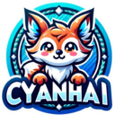

# bevy_ai_script
a bevy script

# tile_war

<!-- PROJECT LOGO -->

  

<h3 align="center">bevy_ai_script</h3>

  Bevy Ai Script

<a href="docs/language.md">语言描述</a> ·

> My English level is not good. I will use my native language
> for now. If the project becomes bigger later (I am not sure)
> , you are welcome to add English.
>
> 这个项目还处于早期建设状态，本人也是初学者，做这个项目来练练手。
>
> 如果你觉得想法不错，可以点个star，或者给我提提意见，我会非常感谢的。

TODO:添加基本描述

## 平台

TODO: 添加系统要求

## 安装

TODO: 添加安装步骤

## 文件结构

TODO: 添加文件结构
